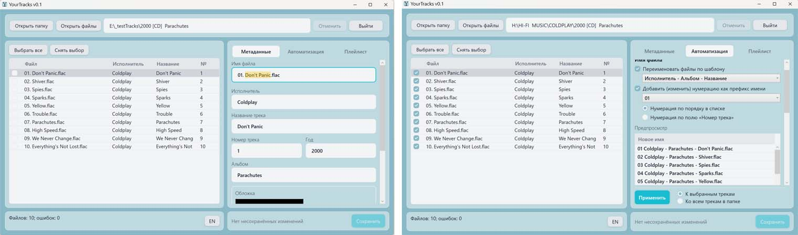
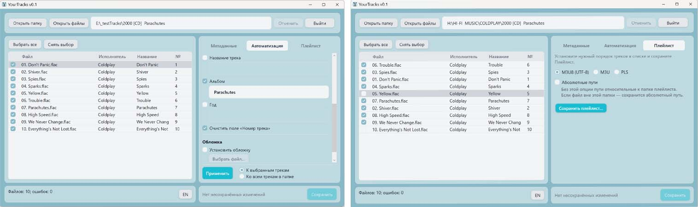

# YourTracks (for Windows)

**[English](README_EN.md)**

Программа поможет быстро и легко навести порядок в вашей музыкальной коллекции. Теперь не нужно тратить время на рутину, вручную переписывая метаданные для каждого файла.

Программа позволяет:

1. Редактировать метаданные любого отдельного трека.
2. Добавлять или изменять метаданные сразу для всего альбома.
3. Переименовывать музыкальный файл прямо в приложении.
4. Массово переименовывать файлы согласно выбранному шаблону.
5. Одним кликом изменять префиксы нумерации треков, меняя порядок треков и шаблон названия префикса.
6. Автоматически добавлять префиксы нумерации файлов в папке, выбирая между нумерацией из метаданных и порядком в редактируемом списке.
7. При необходимости одним нажатием удалять префиксы нумерации в группе файлов или альбоме.
8. Добавлять или изменять обложку для любого трека либо всего альбома.
9. Создавать плейлист простым перетаскиванием треков в списке и сохранять в форматах m3u8, m3u, pls.
10. Сохранять изменения как непосредственно в открытые файлы, так и в виде копии в отдельную папку.
11. Выбирать язык интерфейса: русский или английский.

**Версия:** v0.1

## Скриншоты





## Возможности

- Открытие папки или отдельных файлов (MP3, FLAC, M4A)
- Редактирование artist, title, номера трека, album, year и обложки
- Массовое применение изменений к выбранным файлам или всему списку
- Переименование по шаблонам (`{artist}`, `{title}`, `{album}`, `{year}`, `{track:00}`, …)
- Последовательная нумерация треков по порядку в списке или по существующим тегам
- Сохранение на месте или запись копий в другую папку
- Генерация M3U-плейлистов
- Интерфейс на русском и английском

## Требования

- Windows 10/11
- [.NET 8 SDK](https://dotnet.microsoft.com/download/dotnet/8.0) — для сборки из исходников
- [.NET 8 Desktop Runtime](https://dotnet.microsoft.com/download/dotnet/8.0) — для framework-dependent сборки

## Сборка и запуск

```powershell
dotnet build MetadataEditor.sln
dotnet run --project src/MetadataEditor.App/MetadataEditor.App.csproj
```

## Тесты

```powershell
dotnet test MetadataEditor.sln
```

## Release

Framework-dependent сборка (на целевой машине нужен .NET 8 Desktop Runtime):

```powershell
dotnet publish src/MetadataEditor.App/MetadataEditor.App.csproj `
  -c Release `
  -r win-x64 `
  --self-contained false `
  -o publish/win-x64
```

Self-contained сборка (runtime включён в дистрибутив):

```powershell
dotnet publish src/MetadataEditor.App/MetadataEditor.App.csproj `
  -c Release `
  -r win-x64 `
  --self-contained true `
  -o publish/win-x64-selfcontained
```

Исполняемый файл — `YourTracks.exe` в папке вывода.

## Структура проекта

```text
MetadataEditor.sln
src/
  MetadataEditor.App/     WPF UI (MVVM)
  MetadataEditor.Core/    чтение/запись метаданных, шаблоны, сохранение
tests/
  MetadataEditor.Core.Tests/
```

## Настройки

Пользовательские настройки (язык, геометрия окна) хранятся в:

`%AppData%\YourTracks\settings.json`

## Лицензия

MIT — см. [LICENSE](LICENSE).
